# Authentication Flow Specification with FirebaseAuth

## Overview

This document specifies the authentication and API request flow patterns for Firebase-based authentication in web applications, covering anonymous user authentication, permanent user authentication, and user promotion workflows.

## Authentication Flow Patterns

### 1. Anonymous User Authentication Flow

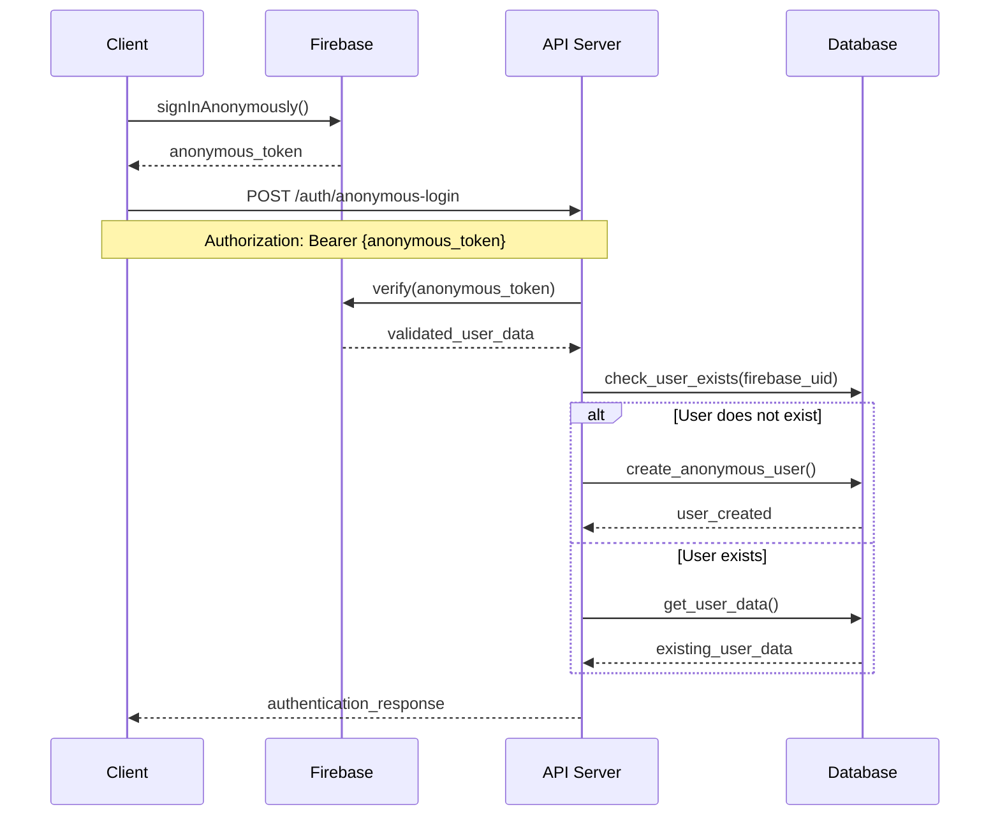

**Flow Characteristics:**
- Single-step authentication process
- Automatic user creation on first authentication
- No email verification required
- Temporary user identity

### 2. Regular User Authentication Flow

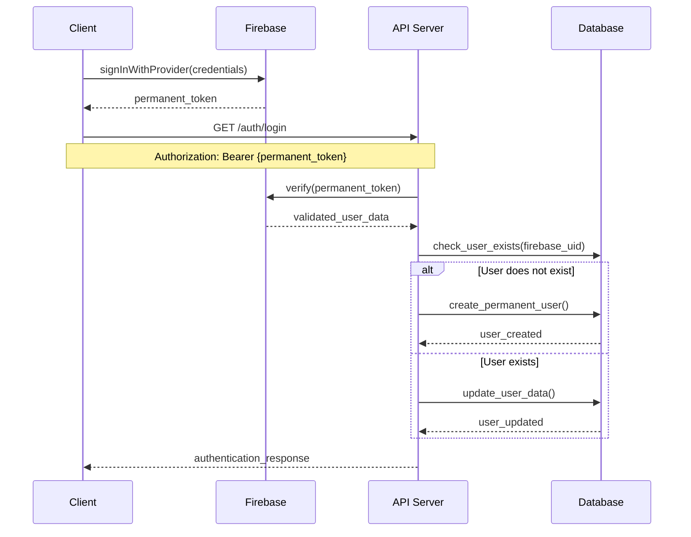

**Flow Characteristics:**
- Provider-based authentication (Google, Apple, Twitter, Email/Password)
- Email verification for certain providers
- Permanent user identity
- User data synchronization with provider

### 3. Anonymous User Promotion Flow

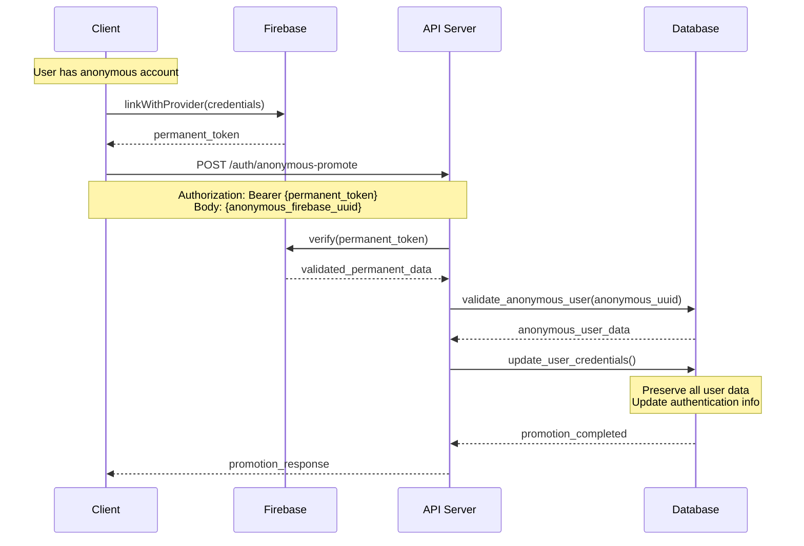

**Flow Characteristics:**
- Converts temporary identity to permanent
- Preserves all user data and relationships
- Validates ownership of anonymous account
- Updates authentication credentials only

## API Request Flow Patterns

### 1. Public API Request Pattern

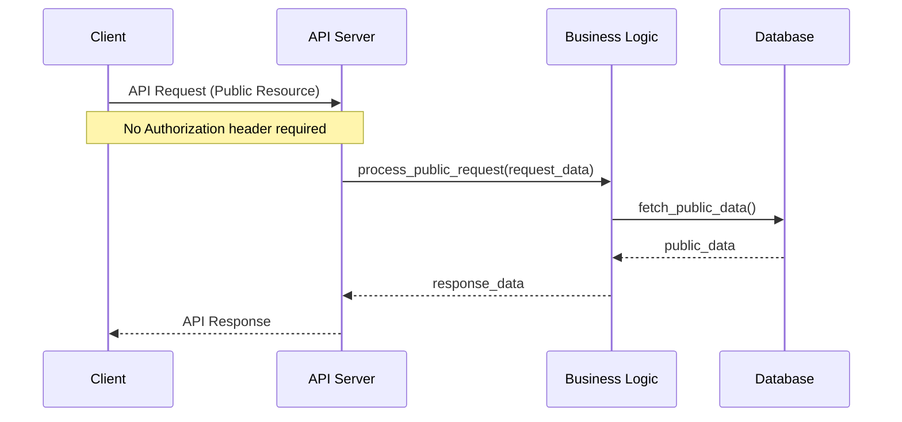

**Request Characteristics:**
- No authentication required
- Public content and resources only
- Rate limiting applied per IP/session
- No user context available
- Limited functionality scope

### 2. Authenticated API Request Pattern

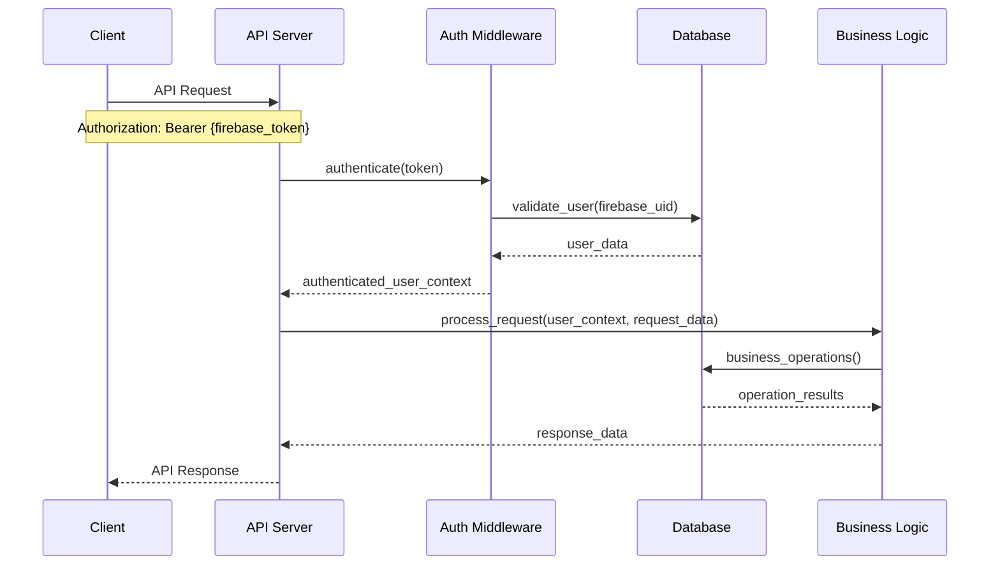

**Request Characteristics:**
- Bearer token authentication required
- User context automatically injected
- Rate limiting applied per user
- Business logic operates with validated user context

### 3. Error Handling Pattern

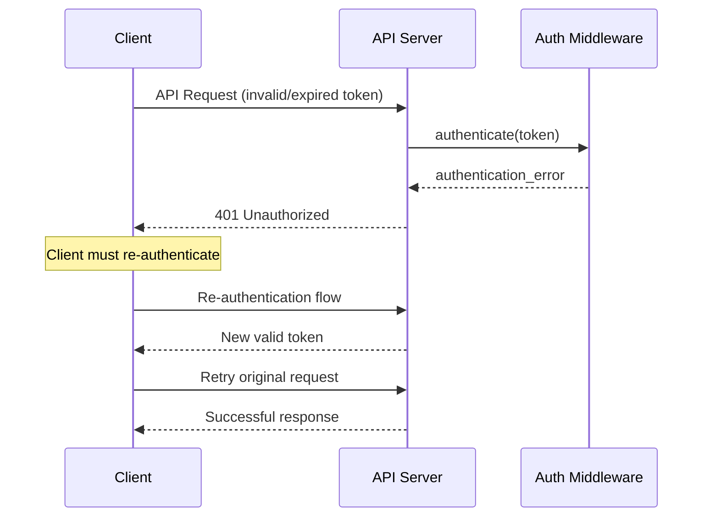


## Authentication States and Transitions

### User State Diagram

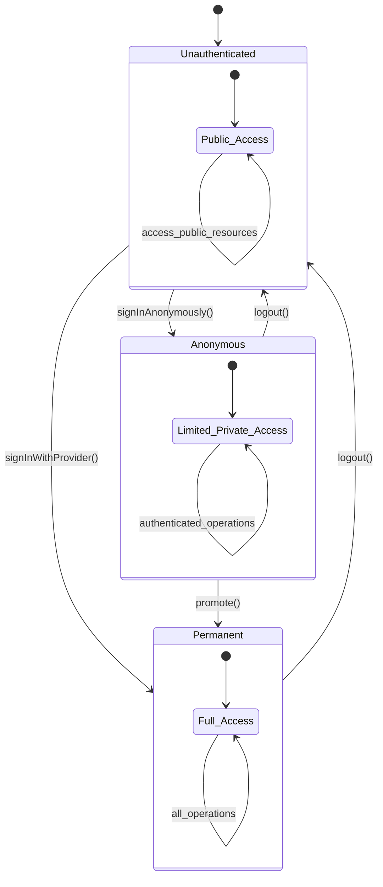

**State Characteristics:**
- **Unauthenticated**: Public resource access only, no authentication required for public content
- **Anonymous**: Public + limited private functionality, temporary identity, promotion possible  
- **Permanent**: Public + full private functionality, persistent identity, provider-linked

## Token Management Patterns

### 1. Token Lifecycle

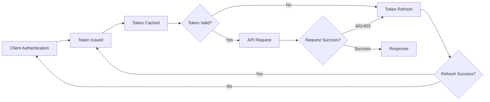

### 2. ID Token Validation Sub-Flow

*This sub-flow is used by all authenticated endpoints for Firebase token validation*

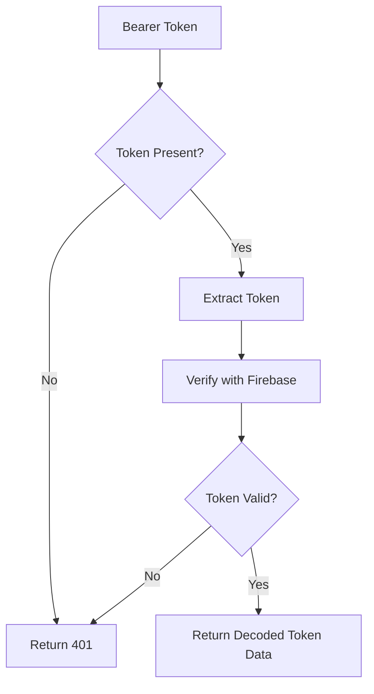

**Sub-Flow Characteristics:**
- **Function**: Firebase token validation only
- **Used by**: All authenticated endpoints (auth and regular APIs)
- **Returns**: Decoded Firebase token data (uid, email, provider, etc.)
- **No database operations**: Pure token validation

## Authentication API Flow Patterns

### 1. Anonymous Login Flow

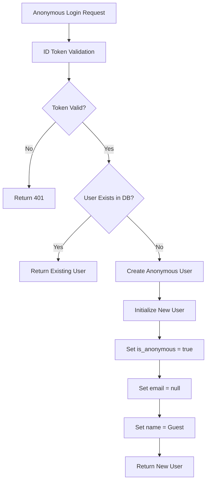

### 2. Anonymous Promotion Flow

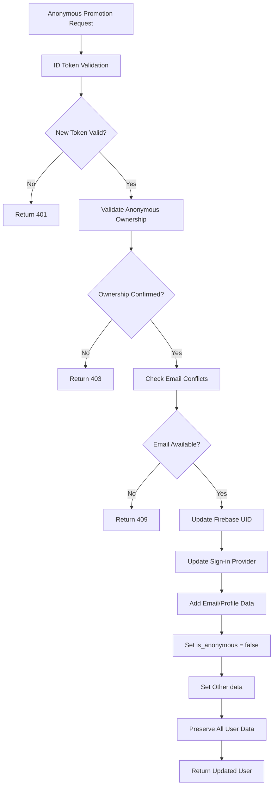

### 3. Regular Sign Up Flow

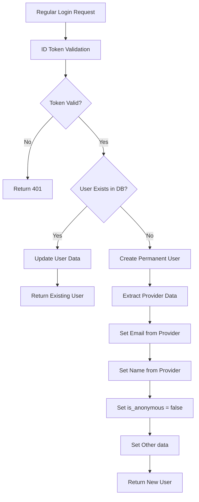

### 4. Regular Login Flow

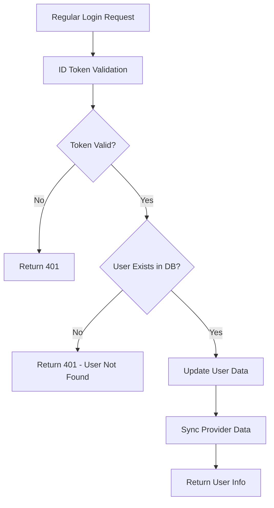

## Regular API Flow Patterns

### 1. Public API Request Flow

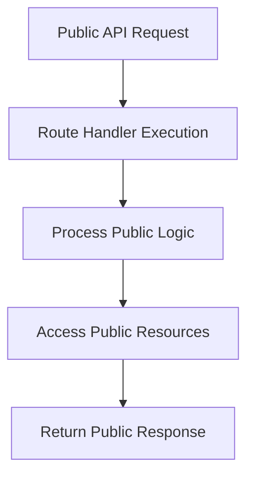

**Flow Characteristics:**
- **No authentication required**: Direct access to public resources
- **Public content only**: Limited to non-sensitive information
- **Rate limiting by IP/session**: Applied per client identifier
- **No user context**: Business logic operates without user data

### 2. Regular API Request Flow

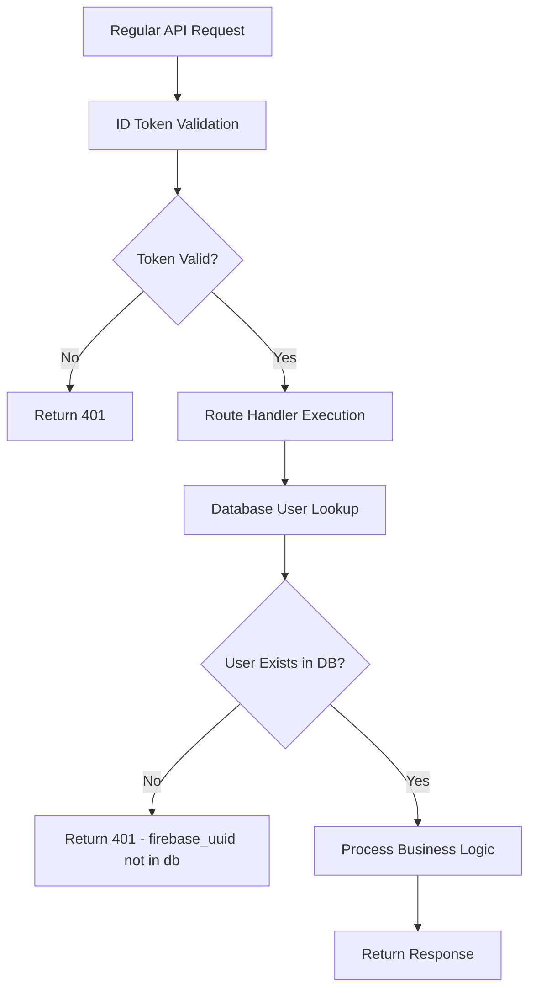

**Flow Characteristics:**
- **Authentication required**: Bearer token validation mandatory
- **User context validated**: Database user lookup performed
- **Strict validation**: Returns 401 if user not found in database
- **Full business logic access**: Complete application functionality

## Error Response Patterns

### Standard Error Structure

```json
{
  "error": {
    "code": "ERROR_TYPE",
    "message": "Human readable description",
    "details": {
      "field": "specific_error_info"
    }
  }
}
```

### Common Error Scenarios

| Scenario | Status Code | Error Code | Description |
|----------|-------------|------------|-------------|
| Missing Token | 401 | `MISSING_AUTH_TOKEN` | Authorization header required |
| Invalid Token | 401 | `INVALID_AUTH_TOKEN` | Token verification failed |
| Expired Token | 401 | `EXPIRED_AUTH_TOKEN` | Token has expired |
| User Not Found | 401 | `USER_NOT_FOUND` | Firebase user not in database |
| Rate Limited | 429 | `RATE_LIMIT_EXCEEDED` | Too many requests |
| Email Conflict | 409 | `EMAIL_EXISTS` | Email already registered |
| Invalid Promotion | 403 | `INVALID_PROMOTION` | Cannot promote this user |

## Integration Patterns

### 1. Client-Side Integration

```javascript
// Authentication Flow Pattern
class AuthService {
  async authenticateAnonymously() {
    const credential = await firebase.signInAnonymously()
    const token = await credential.user.getIdToken()
    return this.exchangeToken('/auth/anonymous-login', token)
  }
  
  async promoteAnonymous(newCredential) {
    const anonymousUid = firebase.auth().currentUser.uid
    await firebase.auth().currentUser.linkWithCredential(newCredential)
    const token = await firebase.auth().currentUser.getIdToken()
    return this.exchangeToken('/auth/anonymous-promote', token, { 
      anonymous_firebase_uuid: anonymousUid 
    })
  }
  
  async makePublicRequest(endpoint, data) {
    // No authentication required for public resources
    return fetch(endpoint, {
      headers: { 'Content-Type': 'application/json' },
      body: JSON.stringify(data)
    })
  }
  
  async makeAuthenticatedRequest(endpoint, data) {
    const token = await firebase.auth().currentUser.getIdToken()
    return fetch(endpoint, {
      headers: { 'Authorization': `Bearer ${token}` },
      body: JSON.stringify(data)
    })
  }
  
  async makeSmartRequest(endpoint, data, requireAuth = false) {
    // Handles both public and authenticated requests
    if (!requireAuth && !firebase.auth().currentUser) {
      return this.makePublicRequest(endpoint, data)
    }
    return this.makeAuthenticatedRequest(endpoint, data)
  }
}
```

### 2. Middleware Integration Pattern

```python
# Server-Side Middleware Pattern
class FirebaseAuthMiddleware:
    def process_request(self, request):
        if self.is_public_endpoint(request.path):
            request.user = None  # No authentication for public resources
            return request
            
        if self.is_optional_auth_endpoint(request.path):
            try:
                return self.authenticate(request)
            except AuthenticationError:
                request.user = None  # Allow public access with no user context
                return request
        
        # Required authentication
        return self.authenticate(request)
    
    def authenticate(self, request):
        token = self.extract_token(request)
        firebase_user = self.verify_token(token)
        user = self.get_or_create_user(firebase_user)
        request.user = user
        return request
    
    def get_or_create_user(self, firebase_user):
        if firebase_user.provider == 'anonymous':
            return self.create_anonymous_user(firebase_user)
        else:
            return self.create_or_update_user(firebase_user)
    
    def is_public_endpoint(self, path):
        public_patterns = ['/public/', '/health', '/status']
        return any(pattern in path for pattern in public_patterns)
    
    def is_optional_auth_endpoint(self, path):
        optional_patterns = ['/content/', '/articles/']
        return any(pattern in path for pattern in optional_patterns)
```

## Performance Considerations

### 1. Caching Strategy

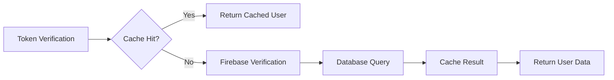

### 2. Rate Limiting Strategy

- **Per-user rate limiting**: Based on Firebase UID
- **Per-endpoint rate limiting**: Different limits for different operations
- **Anonymous user limits**: Stricter limits for temporary users
- **Promotion limits**: Special limits for sensitive operations

## Monitoring and Observability

### Key Metrics to Track

1. **Authentication Metrics**
   - Authentication success/failure rates
   - Token verification latency
   - User creation rates (anonymous vs permanent)

2. **Promotion Metrics**
   - Anonymous to permanent conversion rates
   - Promotion success/failure rates
   - Time between anonymous creation and promotion

3. **Security Metrics**
   - Rate limiting triggers
   - Invalid token attempts
   - Failed promotion attempts

4. **Performance Metrics**
   - API response times with authentication
   - Database query performance for user operations
   - Cache hit rates for user data

This specification provides the foundational patterns for implementing Firebase authentication flows while maintaining security, performance, and user experience standards.